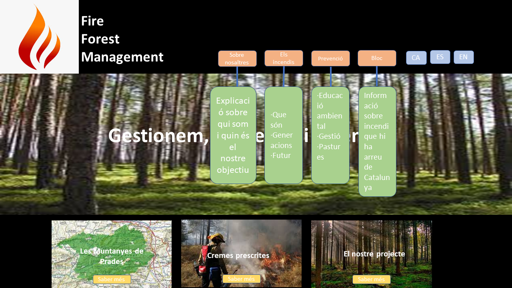
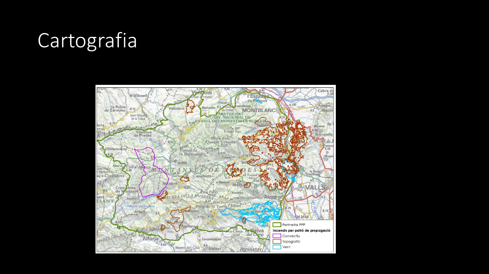
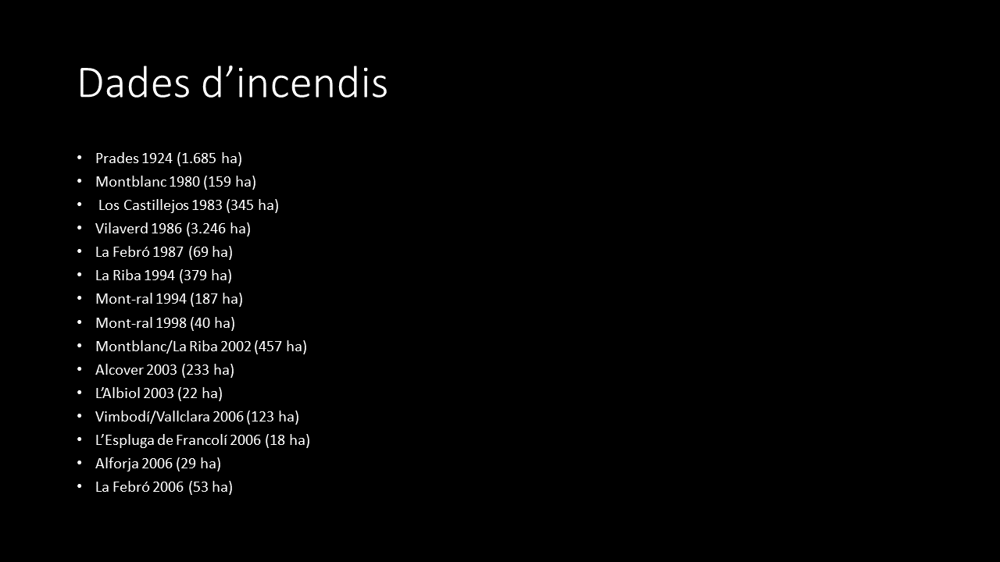

# Anàlisi d'incendis forestals
Aquest repositori conté el codi font per a fer una pàgina web per analitzar incendis forestals

## Justificació
Aquesta web s'utilitzarà per l'anàlisi d'incendis forestals d'incendis històrics per a l'avaluació de fer cremes prescrites en punts crítics de les Muntanyes de Prades.

## Dades
S'utilitzaran dades d'incendis històrics, tant per la seva ubicació com per el seu peímetre i area en forma de polígons

## Estructura de la web

Aquesta és la pàgina inicial

En tota la web hi haurà un menú contextual que desplegarà les diferents informacions

Aquest és el mapa que es podrà consultar a la web

Les dades per a fer el mapa són les següents

## Cartografia
S'utilitzarà cartografia de les muntanyes de prades, ubicació de municipis i polígons de incendis històrics.

## Dificultats i millores
Les dificultats que puc tenir són les de tenir informació sobre cada polígon. 
Milloraria amb la informació de projectes d'actuació de prevenció d'incendis

